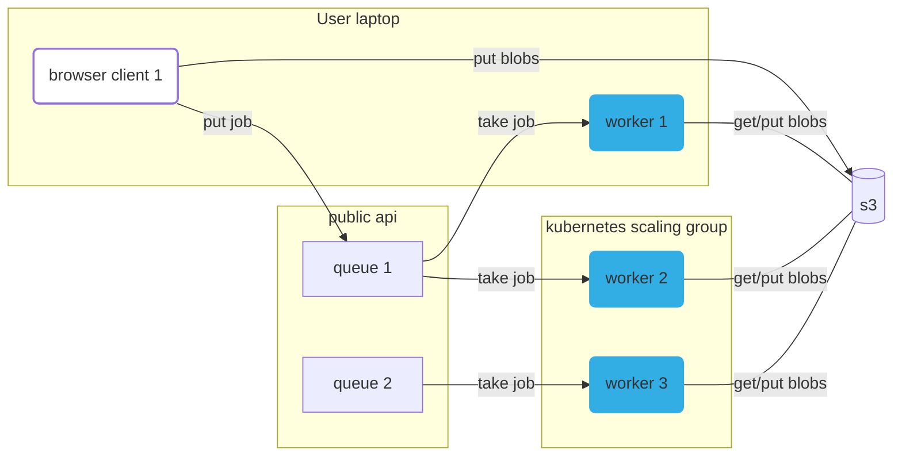

# Public Compute Queues for everyone everywhere all at once

[llms.txt](https://container.mtfm.io/llms.txt)

https://container.mtfm.io

Examples: https://about.metapage.io/examples

High level:

- open-source compute queues built for the public internet, built for both browsers and servers
- queues are simply unique URLs
- compute jobs are also defined by unique URLs
- push a job to any queue, no authentication required
- data is stored for 1 month, then expired
- provide your own workers, this is just queues
- built for [metapages](https://metapage.io) and embedding arbitrary compute in the browser, safely
- deploy your own version of the API

## Quickstart

### Run a worker locally pointing to a queue

Limit to 2 cpus and max job time of 20 minutes

**Local mode: jobs will always run directly on this computer**

```sh
docker run -p 8000:8000 --rm -v /var/run/docker.sock:/var/run/docker.sock -v /tmp:/tmp metapage/metaframe-docker-worker:0.54.31 run --max-job-duration=20m --data-directory=/tmp/worker-metapage-io-local --cpus=2 --mode=local
```

**Remote mode: this worker will pick up jobs on your own queue **

Replace `my-random-queue` with your unique queue name (can be anything)

```sh
docker run --rm -v /var/run/docker.sock:/var/run/docker.sock -v /tmp:/tmp metapage/metaframe-docker-worker:0.54.31 run --max-job-duration=20m --data-directory=/tmp/worker-metapage-io-remote --cpus=2 my-random-queue
```

- client: https://container.mtfm.io/
- [basic demo](https://metapage.io/m/87ae11673508447e883b598bf7da9c5d)

Open-source publicly available compute queues: run queues of containerized work on your laptop, workstations, compute
clusters.

- Every compute job is represented as a unique URL that contains all the context required to run it.
- Every queue is a unique URL. Queues are unguessable, instantly created, both durable and disposable.

## REST API

### Health

- `GET /healthz`\
  Returns "OK" if the server is running.

---

### File Storage

- `GET /f/:key`\
  Download a file (redirects to a signed S3 URL).

- `GET /f/:key/exists`\
  Check if a file exists (returns `{ exists: true/false }`) and http response code `200` : `404` if exists or not

- `PUT /f/:key`\
  Upload a file (redirects to a signed S3 URL for upload).

---

### Jobs

- `POST /q/:queue`\
  Submit a job to a queue. The queue is created if it doesn't exist

- `POST /q/:queue/j`\
  Submit a job to a queue (alias).

- `GET /q/:queue/j`\
  List jobs in a queue.

- `GET /q/:queue`\
  List jobs in a queue (alias).

- `GET /q/:queue/j/:jobId`\
  Get definition, results, and queue status for a specific job.

- `GET /j/:jobId`\
  Get definition and results for a specific job (global lookup).

- `GET /j/:jobId/definition.json`\
  Get the job definition.

- `GET /j/:jobId/result.json`\
  Get the job result.

- `GET /j/:jobId/results.json`\
  Get the job result (alias).

- `GET /j/:jobId/inputs/:file`\
  Get the job input file.

- `GET /j/:jobId/outputs/:file`\
  Get the job output file.

- `POST /j/:jobId/copy`\
  Copy a job to another queue.

- `GET /q/:queue/j/:jobId/definition.json`\
  Get the job definition (scoped to queue).

- `GET /q/:queue/j/:jobId/result.json`\
  Get the job result (scoped to queue).

- `GET /q/:queue/j/:jobId/inputs/:file`\
  Get the job input file.

- `GET /q/:queue/j/:jobId/outputs/:file`\
  Get the job output file.

- `GET /q/:queue/j/:jobId/results.json`\
  Get the job result (scoped to queue).

- `GET /q/:queue/j/:jobId/namespaces.json`\
  Get namespaces for a job in a queue.

- `POST /q/:queue/j/:jobId/cancel`\
  Cancel a job in a queue.

- `POST /q/:queue/j/:jobId/:namespace/cancel`\
  Cancel a job in a specific namespace in a queue.

---

### Queue Status & Metrics

- `GET /q/:queue/status`\
  Get status for a queue.

- `GET /q/:queue/metrics`\
  Get Prometheus-compatible metrics for a queue.

---

### Deprecated Endpoints

- `GET /upload/:key`\
  Deprecated upload endpoint.

- `GET /download/:key`\
  Deprecated download endpoint.

- `GET /:queue/status`\
  Deprecated queue status endpoint.

- `GET /:queue/metrics`\
  Deprecated queue metrics endpoint.

## Background

A common problem in sharing scientific workflows is that compute isn’t portable. Workflow engines, such as
[Nextflow](https://www.nextflow.io/), or code environments such [Jupyter Notebooks](https://jupyter.org/) have the
compute tightly connected to the overall environment.

This means you can’t just simply share code and data and expect others to run it easily—differences in environments,
libraries, and hardware often get in the way, and most environments are highly complex to set up. These systems were not
built from the beginning to be web-first shareable, and require an all-or-nothing approach to using those systems.

Existing systems for work queues exist, but they are either built for different specific purposes, such as CI/CD
pipelines (github actions and google cloud build), or they are internal and language specific.

Project Asman solves this by providing a web-based queue API. A lightweight web or CLI client submits Docker jobs to a
queue. If the queue does not exist, it is immediately created. Any connected worker—yours, your institution’s, or a
collaborator’s—can pick up the job, run it, and return the results. Supporting small teams to collaborate was a driving
force for this project.

The API is efficient, open-source, and built for flexibility: workers can run locally, on a cluster, or be dynamically
scaled via cloud providers. Docker images can be pulled directly or built from a Git repo.

This repo includes:

- The queue and worker infrastructure
- Example cloud deployments
- Support for metapage-style workflows using containerized metaframes

Online docs: [Online docs notion source](https://docs.metapage.io/docs/containers)

## Quick setup / getting started

### 1) Run a worker (optional)

👉 You can skip this step if you use the queue `public1` where we supply a small amount of available compute.

❗ Replace `my-unique-queue-name` with a unique id or uuid or queue name, it can be anything

```sh
docker run --rm -v /var/run/docker.sock:/var/run/docker.sock -v /tmp:/tmp metapage/metaframe-docker-worker:0.54.30 run --max-job-duration=20m --data-directory=/tmp/worker-metapage-io-remote --cpus=2 my-unique-queue-name
```

### 2) Run a compute job

Go to the web client
[configured with a simple job](https://container.mtfm.io/#?ignoreQueueOverride=true&job=JTdCJTIyY29tbWFuZCUyMiUzQSUyMmVjaG8lMjAlNUMlMjJoZWxsbyUyMHdvcmxkJTVDJTIyJTIyJTJDJTIyaW1hZ2UlMjIlM0ElMjJhbHBpbmUlM0EzLjE5LjElMjIlN0Q%3D&queue=public1).

- Click on the queue button at the bottom right. Enter your queue name (same as the worker queue)
- Click `Run Job` and the web client will submit the job to the queue, which will be picked up by the

The URL hash content uniquely defines the container job definition.

## Developers

The API runs as cloudflare or deno workers: highly efficient and cost-effective server endpoints that simply record the
current job queue.

Blob storage is via an S3 compatible API. Important: in the public version, all jobs are deleted after a week. This
keeps costs extremely low, and allows us to provide public queues at low cost.

### Developer background

This service provides docker compute functions as metaframes for the [metapage.io](https://metapage.io) platform. This
allows sharing complex containerized workflows simply via URLs.

This service serves a web cliebt as an iframe (metaframe), that allows users to configure running a specific docker
container (a **job**) on a specific **queue**. The iframed browser window sends that job configuration to the server,
the job is added to the queue, then workers pick up the job, run it, and send the results back.

To run those docker containers, users can either rent compute from the metapage platform, or run worker(s) themselves,
either on their own personal laptops/desktops, or on their own cluster infrastructure. Docker images can be used
directly, or a git repo can be given, and the docker image built directly.

This repo contains all the infrastructure for the queues, workers, and examples of cloud providers managing the
horizintal scaling worker fleets.

### High level commands:

- develop: `just dev`
- bump or set a new version and publish artifacts: `just deploy`
- test the entire project: `just test`

Finer commands are `just` in subdirectories.

### Overview

**Quick links:**

- `production api`: https://container.mtfm.io/



### Local development

#### Host requirements:

- `just`: https://just.systems/man/en/chapter_1.html
- `docker`: https://docs.docker.com/engine/install/
- `deno`: https://docs.deno.com/runtime/manual/getting_started/installation
- `mkcert`: https://github.com/FiloSottile/mkcert
  - ❗ 👉 Make sure you run `mkcert -install` ❗

Run the local stack:

```
just dev
```

Go to this [Test metapage](https://metapage.io/m/d31841d2c46d487b8b2d84795ab0f1b1) to interact with a running
simulation.

You might need to wait a bit to refresh the browser, it incorrectly returns a `200` when there are no browser assets
(yet). (This looks like a bug with the hono webserver).

You can edit browser code, worker code, api code, and CLI and everything automatically updates.

#### Tests

- `just test`: runs the entire test suite, creating a new local stack
  - runs on every push to non-main branches
- `just app/test/watch`: (requires a running local stack) runs functional tests, currently only permissions
  - see `just api/test` for more test related commands

#### Start each service separately

You can develop workers locally, pointing to prod or local API

```sh
  just app/worker/dev
  # or
  just worker dev

  just app/worker/prod
  # or
  just worker prod
```

You can develop the browser locally, pointing to prod or local API

```sh
  just app/browser/dev
  # or
  just browser dev

  just app/browser/prod
  # or
  just browser prod
```

#### Submit jobs via the CLI

To the local stack:

```typescript
cd app/cli
deno run --unsafely-ignore-certificate-errors --location https://worker-metaframe.localhost --allow-all src/cli.ts job add local1 --file ../../README.md -c 'sh -c "cat /inputs/README.md > /outputs/readme-copied.md"' --wait
```

To the production stack:

```typescript
cd app/cli
deno run --allow-all src/cli.ts job add public1 --file ../../README.md -c 'sh -c "cat /inputs/README.md > /outputs/readme-copied.md"' --wait
```

The CLI tool has yet to be versioned and binaries built https://github.com/metapages/compute-queues/issues/21

#### Local development: cloud compute providers

E.g. kubernetes, nomad.

1. Run the local stack with `just dev`
2. Workers in the local worker cluster need to be able to reach (on the host): `https://worker-metaframe.localhost`
   1. Point the workers to a queue
3. Go to [this metapage](https://app.metapage.io/dion/d31841d2c46d487b8b2d84795ab0f1b1?view=default)
   1. You should see the docker runner at the bottom, change the slider to create compute jobs

### Deployment (automation)

**(public) api:**

- push to `main`:
  - The `api` server is deployed to [deno.deploy](https://dash.deno.com/projects/compute-queue-api)
    - The `browser` is built as part of the `api`

**worker:**

- git semver tag:
  - the `worker` image is built, published
    - TODO: https://github.com/metapages/compute-queues/issues/2
  - `worker` host requirements:
    - just [docker](https://docs.docker.com/engine/install/)
  - our cloud worker providers update the worker version and redeploy
    - TODO: https://github.com/metapages/compute-queues/issues/3

## 💖🙏🤝 Acknowledgements

- `2025`: support for this work was funded by [Astera](https://astera.org/open-science/) to which I am grateful. Due to
  this support, I aim to keep this project open and supported for as long as it is useful.
- `2018`: the seed for this work was a previous project (https://github.com/dionjwa/docker-cloud-compute) supported by
  Autodesk Life Sciences (which was an amazing ambitious reach of innovation)
