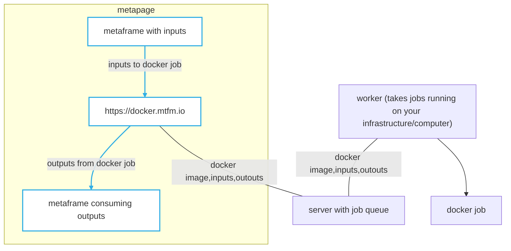

# Run docker containers as metaframes in the browser

[llms.txt](container.mtfm.io/llms.txt)

## Quickstart: Run a worker

Run a worker pointing to a queue `public1` (you can change this queue name to anything you like, just make it long and
unguessable):

```
docker run  --pull always --restart unless-stopped -tid -v /var/run/docker.sock:/var/run/docker.sock -v /tmp:/tmp metapage/metaframe-docker-worker:0.39.0 run --cpus=4 --gpus=0 public1
```

## Quickstart: Run a job from the browser

Go
[this link](https://container.mtfm.io/?command=cHJpbnQgXCggc2Rmc2RmMiBcKQ%3D%3D&image=python3#/queue/1?command=cHl0aG9uIC1jICdwcmludCgiaGVscCIpJw%253D%253D&image=python%253A3.8.8-alpine3.13&job=JTdCJTIyY29tbWFuZCUyMiUzQSUyMnB5dGhvbiUyMC1jJTIwJ3ByaW50KCU1QyUyMmhlbHAlNUMlMjIpJyUyMiUyQyUyMmltYWdlJTIyJTNBJTIycHl0aG9uJTNBMy4xMi4xLWFscGluZTMuMTklMjIlN0Q=&queue=public1)
to run a simple python job using the worker above:

## Inputs, outputs, and caching

- env var `JOB_INPUTS` is the directory where job input files are copied. Defaults to `/inputs`
- env var `JOB_OUTPUTS` is the directory where job output files will be copied when the job finishes successfully.
  Defaults to `/outputs`

### Set job and read results from another metaframe

If the client option `Allow upstream metaframes to modify the job` is enabled, then the input field name `job` is
treated as a job definition, and allows upsteam metaframes to modify the job, and read the outputs

E.g. from another metaframe, send the value `job` as:

```json
{
  "image": "alpine:3.18.5",
  "command": "ls -la"
}
```

This will run the above job, and the output of the job will be sent as the output `job/result.json`

See [this example](https://metapage.io/dion/1220580fb99b4ec5a256519691579c3c)

### Define Inputs and Outputs

In `Settings / Definition` you can define inputs and outputs. This doesn't change how the code runs, but it allows much
easier connecting upstream and downstream metaframes when editing [metapages](https://metapage.io).

In this example, we defined an input: `input.json` and an output `data.csv`:


You will see these inputs and outputs automatically in the metapage editor.

### Directory for caching data and large ML models

The directory defined in the env var `JOB_CACHE` (defaults to `/job-cache`) is shared between all jobs running on a
host. Use this location to store large data sets and models.

The cache is not shared between worker instances, only between jobs running on a single instance or computer.

## Description

`container.mtfm.io` runs docker containers on workers. It is currently in beta.

- Run any publicly available docker image: `Python`, `R`, `C++`, `Java`, ... anything.
- Bring your own workers
  - Currently individual machines are supported, but kubernetes and nomad support coming soon
- Your queue is simply an unguessable hash. Do not share it without consideration.

Use cases:

- machine learning pipelines
- data analysis workflows

Any time the inputs change (and on start) the configured docker container is run:

- `/inputs` is the location where inputs are copied as files
- `/outputs`: any files here when the container exits are passed on as metaframe outputs



Versioned. Reproducible. No client install requirements, as long as you have at least one worker running somewhere, you
can run any programming language.

## Getting started

1. Create a queue
   - Click the connect button in the bottom-right
   - A "queue" is simply string or key
   - The part of the URL that looks like `#?queue=my-queue-e7eebea2-c607-11ee-84de-b7a272dd08fc`
   - Best if the `queue` value is a long impossible to guess string e.g. a GUID
   - Workers point to this queue, and run the configured docker jobs
2. Configure the docker job
3. Run a worker (or a bunch) pointing to a queue: `public1` (warning: this is a public shared compute queue)
   ```
   docker run --pull always --restart unless-stopped -tid -v /var/run/docker.sock:/var/run/docker.sock -v /tmp:/tmp metapage/metaframe-docker-worker:0.39.0 run --cpus=4 --gpus=0 public1
   ```

If you have GPUs, you can add `--gpus=1` (or more) to the worker command.

## Example URL

Run the python command in a container:

https://container.mtfm.io/?command=cHJpbnQgXCggc2Rmc2RmMiBcKQ%3D%3D&image=python3#/queue/1?command=cHl0aG9uIC1jICdwcmludCgiaGVscCIpJw%253D%253D&image=python%253A3.8.8-alpine3.13&job=JTdCJTIyY29tbWFuZCUyMiUzQSUyMnB5dGhvbiUyMC1jJTIwJ3ByaW50KCU1QyUyMmhlbHAlNUMlMjIpJyUyMiUyQyUyMmltYWdlJTIyJTNBJTIycHl0aG9uJTNBMy4xMi4xLWFscGluZTMuMTklMjIlN0Q=&queue=public1
