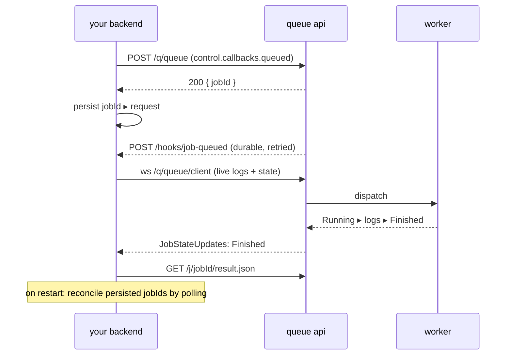

# Backend integration

How to put a compute queue behind a Node or Deno backend: submit jobs, and get results back by **polling**, by
**websocket**, or by **callback**.

Everything on this page was run against `https://container.mtfm.io`. The same code works against a self-hosted API or a
`--mode=local` worker by changing one constant.

## TL;DR — which one do I use?

| Pattern       | Works today | Latency          | Survives a restart | Use when                                                    |
| ------------- | ----------- | ---------------- | ------------------ | ----------------------------------------------------------- |
| **Polling**   | ✅ always   | your interval    | ✅ yes             | Default. Batch work, serverless, anything that can restart. |
| **WebSocket** | ✅ yes      | ~instant, + logs | ❌ no              | Live progress, streaming logs, interactive UIs.             |
| **Callback**  | ⚠️ partial  | ~instant         | ✅ yes             | Only fires on **enqueue**, not on finish. See below.        |

::: warning About callbacks
`control.callbacks.queued` is real and reliable: the server POSTs to your URL when the job is accepted, and retries
every minute until you answer 2xx.

`control.callbacks.finished` exists in the TypeScript types but **no code reads it** — there is no completion webhook.
To learn a job finished, poll or use the websocket. The callback is still useful as a durable "job accepted" signal, and
[the hybrid pattern](#hybrid-callback-websocket-polling) below shows how to combine it.
:::

## Setup

```
API   = https://container.mtfm.io      # or your own deployment, or http://localhost:8000
QUEUE = a name nobody can guess        # this is the only access control there is
```

Runtime requirements: **Deno** (anything current) or **Node 18+** for `fetch`, **Node 22+** for the built-in `WebSocket`
(on older Node, `npm i ws`). No SDK — it is all plain HTTP.

## 1. Submit a job

```js
// submit.mjs — works in Node 18+ and Deno
const API = "https://container.mtfm.io";

export async function submitJob(queue, definition, control) {
  const res = await fetch(`${API}/q/${queue}`, {
    method: "POST",
    headers: { "content-type": "application/json" },
    body: JSON.stringify({ definition, control }),
  });
  if (!res.ok) throw new Error(`submit failed ${res.status}: ${await res.text()}`);
  const { jobId } = await res.json(); // => { success: true, jobId }
  return jobId;
}
```

```js
const jobId = await submitJob("my-queue", {
  image: "alpine:3.19.1",
  command: 'sh -c "echo hello > /outputs/greeting.txt"',
});
```

Two things to internalise:

1. **`jobId` is `sha256(definition)`.** Resubmitting an identical definition returns the same id and, if it already ran,
   the cached result — no new execution. Add a nonce to `env` if every call must actually run.
2. **Submitting does not mean running.** If no worker is attached to that queue, the job sits in `Queued` indefinitely.
   Check `GET /q/<queue>/status` → `localWorkers`.

## 2. Get the result

### Polling — always works {#polling}

One endpoint, one rule: `{"data": null}` means _not finished yet_.

```js
// poll.mjs
const API = "https://container.mtfm.io";

export async function waitForJob(queue, jobId, { intervalMs = 1000, timeoutMs = 600_000 } = {}) {
  const deadline = Date.now() + timeoutMs;
  while (Date.now() < deadline) {
    const res = await fetch(`${API}/q/${queue}/j/${jobId}/result.json`);
    if (res.ok) {
      const { data } = await res.json();
      if (data?.state === "Finished") return data;
    }
    await new Promise((r) => setTimeout(r, intervalMs));
  }
  throw new Error(`timed out waiting for ${jobId}`);
}
```

Interpreting what comes back — **two** independent success checks:

```js
const data = await waitForJob("my-queue", jobId);

// did the *job* complete normally?
//   Success | Error | TimedOut | Cancelled | WorkerLost | JobReplacedByClient | Deleted
if (data.finishedReason !== "Success") throw new Error(`job ${data.finishedReason}`);

// did the *program* succeed?
const { StatusCode, duration, logs, outputs } = data.finished.result;
if (StatusCode !== 0) throw new Error(`exit ${StatusCode}`);
```

A real response:

```json
{
  "data": {
    "state": "Finished",
    "finishedReason": "Success",
    "worker": "3a645624-…",
    "finished": {
      "reason": "Success",
      "time": 1784941344264,
      "result": {
        "StatusCode": 0,
        "duration": 184,
        "isTimedOut": false,
        "logs": [["stdout-line\n", 1784941344026]],
        "outputs": { "greeting.txt": { "type": "base64", "value": "aGVsbG8K" } }
      }
    }
  }
}
```

**Pick a sane interval.** 1s while you expect the job to be quick, backing off to 5s, is plenty. The endpoint is cheap
but it is not free.

```js
// exponential backoff, capped
let wait = 500;
const next = () => (wait = Math.min(wait * 1.5, 5000));
```

Polling is the pattern to reach for by default. It is stateless, so a backend that crashes and restarts just resumes
polling with the `jobId` it stored — no reconnection logic, no missed events, works from a serverless function or a cron
loop.

### WebSocket — live state and logs {#websocket}

Connect to `wss://<api>/q/<queue>/client`. The server pushes:

| Message            | Payload                                                |
| ------------------ | ------------------------------------------------------ |
| `JobStates`        | Full snapshot of the queue. Sent on connect.           |
| `JobStateUpdates`  | Deltas as jobs change state.                           |
| `JobStatusPayload` | Live log lines and progress steps from the worker.     |
| `Workers`          | Which workers are connected, and their CPU/GPU counts. |

::: tip The websocket carries state, never results
`JobStates` / `JobStateUpdates` tell you a job reached `Finished`. They do **not** include the result body. Fetch
`result.json` once you see the transition. This is deliberate — results can be large.
:::

```js
// ws.mjs — Node 22+ / Deno (Node 18-20: import WebSocket from "ws")
const API = "https://container.mtfm.io";

export function waitForJobWs(queue, jobId, { timeoutMs = 600_000 } = {}) {
  return new Promise((resolve, reject) => {
    const socket = new WebSocket(`${API.replace(/^http/, "ws")}/q/${queue}/client`);
    const timer = setTimeout(() => {
      socket.close();
      reject(new Error("timeout"));
    }, timeoutMs);
    const done = (fn, arg) => {
      clearTimeout(timer);
      socket.close();
      fn(arg);
    };

    socket.addEventListener("open", () => {
      // Covers the race where the job finished before we connected:
      // ask explicitly instead of waiting for a delta that will never come.
      socket.send(JSON.stringify({ type: "QueryJob", payload: { jobId } }));
    });

    socket.addEventListener("error", (e) => done(reject, e));

    socket.addEventListener("message", async (event) => {
      const msg = JSON.parse(event.data);

      if (msg.type === "JobStates" || msg.type === "JobStateUpdates") {
        const job = msg.payload?.state?.jobs?.[jobId];
        if (job?.state === "Finished") {
          const { data } = await (await fetch(`${API}/q/${queue}/j/${jobId}/result.json`)).json();
          done(resolve, data);
        }
      }

      if (msg.type === "JobStatusPayload" && msg.payload?.jobId === jobId) {
        // live progress: step is "docker image pull" | "docker build" | "Running" | …
        for (const [line] of msg.payload.logs ?? []) process.stdout.write(line);
      }
    });
  });
}
```

Submitting **over** the same socket (instead of REST) is also supported — that is what the CLI and the browser client
do:

```js
socket.send(JSON.stringify({
  type: "StateChange",
  payload: {
    job: jobId, // sha256 of the definition
    tag: "",
    state: "Queued",
    value: { type: "Queued", time: Date.now(), enqueued: { id: jobId, definition, control } },
  },
}));
```

Computing the hash yourself is fiddly; `POST /q/<queue>` over REST while listening on the socket is simpler and
equivalent. Open the socket **before** you submit so you cannot miss the transition.

**Operational notes**

- Send the string `PING`; the server replies `PONG`. Use it as a heartbeat.
- Reconnect with backoff and re-send `QueryJob` for every job you still care about. The connect-time `JobStates`
  snapshot also carries them.
- One socket for the whole queue — do not open one per job.
- A websocket does **not** survive a process restart. If durability matters, store `jobId` and fall back to polling. See
  [the hybrid pattern](#hybrid-callback-websocket-polling).

### Callback (webhook) — durable "accepted" signal {#callback}

```js
const jobId = await submitJob("my-queue", definition, {
  namespace: "user-42",
  callbacks: {
    queued: {
      url: "https://my.app/hooks/job-queued",
      payload: { requestId: "abc-123" }, // opaque; echoed back to you
    },
  },
});
```

The server POSTs, and keeps retrying every minute until it gets a 2xx:

```json
{
  "jobId": "c0320fc2…",
  "queue": "my-queue",
  "namespace": "user-42",
  "config": { "requestId": "abc-123" }
}
```

Receiver:

```js
// Express / Hono / plain node:http — respond 200 quickly, work afterwards.
app.post("/hooks/job-queued", async (req, res) => {
  const { jobId, queue, config } = req.body;
  res.status(200).end(); // stop the retry loop first
  await recordAccepted(config.requestId, jobId);
});
```

Make the handler **idempotent** — a slow or failed response means it is called again a minute later.

::: danger This fires on enqueue, not on completion
There is no completion webhook today. After a `queued` callback you still have to poll or listen on the websocket for
the result. `callbacks.finished` in the types is not wired to anything.
:::

Your webhook URL must be reachable from the API server, which rules out `localhost` in development — use a tunnel
(`cloudflared tunnel`, `ngrok`), or just poll while developing.

### Hybrid: callback + websocket + polling {#hybrid-callback-websocket-polling}

The production-grade shape, and the one to copy if you are building something real:



1. Submit over REST, persist `jobId` against your request row.
2. Use the `queued` callback as the durable "the queue has it" signal.
3. Keep one websocket per queue for live state and logs.
4. On boot, poll `result.json` for every persisted unfinished `jobId` — that reconciliation loop is what makes the whole
   thing restart-safe.

## 3. Files in and out

Small values inline; anything over ~200 bytes goes through blob storage.

```js
import { createHash } from "node:crypto";

const API = "https://container.mtfm.io";

// Upload once, reference by URL. The key is the sha256 of the content,
// so re-uploading the same bytes is a no-op.
export async function uploadInput(bytes) {
  const hash = createHash("sha256").update(bytes).digest("hex");
  const exists = await fetch(`${API}/f/${hash}/exists`);
  if (exists.status !== 200) {
    const put = await fetch(`${API}/f/${hash}`, { method: "PUT", body: bytes, redirect: "follow" });
    if (!put.ok) throw new Error(`upload failed ${put.status}`);
  }
  return { type: "url", value: `${API}/f/${hash}` };
}
```

```js
const definition = {
  image: "python:3.12-slim",
  command: "python /inputs/run.py",
  inputs: {
    "run.py": { type: "utf8", value: "print(open('/inputs/data.csv').read()[:100])" },
    "data.csv": await uploadInput(csvBytes), // big file, by reference
  },
};
```

Reading outputs — inline or by reference, plus a raw byte route that works for both:

```js
export async function readOutput(outputs, name) {
  const ref = outputs[name];
  if (!ref) return undefined;
  if (ref.type === "base64") return Buffer.from(ref.value, "base64");
  if (ref.type === "utf8") return Buffer.from(ref.value, "utf8");
  if (ref.type === "json") return Buffer.from(JSON.stringify(ref.value), "utf8");
  if (ref.type === "url") return Buffer.from(await (await fetch(ref.value)).arrayBuffer());
  throw new Error(`unknown dataref type ${ref.type}`);
}

// or skip the ref entirely and let the API resolve it:
const bytes = await (await fetch(`${API}/q/${queue}/j/${jobId}/outputs/report.pdf`)).arrayBuffer();
```

More detail: [Files in & out](/guide/files).

## 4. A complete Deno backend

An HTTP service that accepts work, runs it on the queue, and answers with the result. Node 22+ runs this too — swap
`Deno.serve` for `node:http` and `Deno.env` for `process.env`.

```ts
// server.ts — deno run --allow-net --allow-env server.ts
const API = Deno.env.get("COMPUTE_API") ?? "https://container.mtfm.io";
const QUEUE = Deno.env.get("COMPUTE_QUEUE")!; // unguessable name

const submit = async (definition: unknown, control?: unknown) => {
  const res = await fetch(`${API}/q/${QUEUE}`, {
    method: "POST",
    headers: { "content-type": "application/json" },
    body: JSON.stringify({ definition, control }),
  });
  if (!res.ok) throw new Error(`submit ${res.status}: ${await res.text()}`);
  return (await res.json()).jobId as string;
};

const wait = async (jobId: string, timeoutMs = 300_000) => {
  const deadline = Date.now() + timeoutMs;
  let interval = 500;
  while (Date.now() < deadline) {
    const { data } = await (await fetch(`${API}/q/${QUEUE}/j/${jobId}/result.json`)).json();
    if (data?.state === "Finished") return data;
    await new Promise((r) => setTimeout(r, interval));
    interval = Math.min(interval * 1.5, 5000);
  }
  throw new Error("timeout");
};

Deno.serve({ port: 8080 }, async (req) => {
  if (req.method !== "POST") return new Response("POST a { script } body", { status: 405 });

  const { script } = await req.json();
  const jobId = await submit({
    image: "python:3.12-slim",
    command: "python /inputs/main.py",
    inputs: { "main.py": { type: "utf8", value: script } },
    requirements: { cpus: 1, maxDuration: "5m" },
  });

  const data = await wait(jobId);
  const result = data.finished?.result;
  return Response.json({
    jobId,
    ok: data.finishedReason === "Success" && result?.StatusCode === 0,
    reason: data.finishedReason,
    exitCode: result?.StatusCode,
    durationMs: result?.duration,
    stdout: (result?.logs ?? []).filter((l: unknown[]) => !l[2]).map((l: unknown[]) => l[0]).join(""),
    stderr: (result?.logs ?? []).filter((l: unknown[]) => l[2]).map((l: unknown[]) => l[0]).join(""),
    outputs: Object.keys(result?.outputs ?? {}),
  });
});
```

Log lines are `[text, timestampMs, isStdErr?]` — the third element is `true` for stderr and absent for stdout.

## Production checklist

- [ ] **Queue name is unguessable** and stored as a secret. It is the whole access control model.
- [ ] **A worker is actually attached** — assert `localWorkers` is non-empty in a health check, or jobs silently pile up
      in `Queued`.
- [ ] **`maxDuration` on every job**, plus `--max-job-duration` on the worker.
- [ ] **Both success checks**: `finishedReason === "Success"` _and_ `result.StatusCode === 0`.
- [ ] **`jobId` persisted** before you start waiting, so a restart can reconcile by polling.
- [ ] **Nonce in `env`** if a resubmitted identical definition must re-run instead of returning the cached result.
- [ ] **`control.namespace`** if a client can submit faster than jobs finish.
- [ ] **Copy anything you need to keep** — public-instance data expires in about a month.
- [ ] **Webhook handlers are idempotent** and answer 2xx before doing work.
- [ ] **Self-host or run `--mode=local`** if the data may not leave your infrastructure.

## Give this page to an AI

Everything here is packaged as an Agent Skill so a coding agent gets it right without being briefed:
[Agent Skill](/guide/agent-skill).
