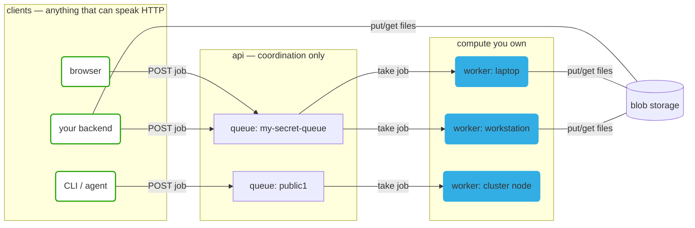

# How it works

Three moving parts, and only one of them is ours.



## The API is a coordinator, not a compute service

The server holds a small amount of state — which jobs exist, what state they are in, where their blobs live — and
nothing else. It never runs a container. All execution happens on workers that **you** started, on machines that **you**
own.

That is what makes the public instance cheap enough to leave open with no authentication, and it is why "add compute" is
a `docker run` rather than a billing page.

## A queue is a URL

`POST /q/<anything>` creates the queue `<anything>` if it does not exist. There is no registration step and no delete
step — a queue with no jobs and no workers costs nothing and effectively does not exist.

Access control is the name itself. A queue called `report-generator` is public in practice. A queue called `q-9f3a1c...`
generated from a UUID is private in practice. Pick accordingly.

## A job is a container plus its inputs

```json
{
  "image": "python:3.12-slim",
  "command": "python /inputs/run.py",
  "inputs": { "run.py": { "type": "utf8", "value": "print('hi')" } }
}
```

Inside the container: `/inputs` is read, `/outputs` is collected, `/job-cache` survives between jobs on the same worker.
Whatever ends up in `/outputs` comes back attached to the result.

The job id is `sha256(definition)`, so identical work is deduplicated: the second submitter of the same definition joins
the first one's job, and a definition that already ran returns its cached result immediately.

## Workers are interchangeable

A worker registers against a queue name, advertises its CPUs and GPUs, takes jobs, and streams logs back. Stop one
mid-job and the job returns to the queue (`WorkerLost`). Start ten and the queue drains ten at a time. They can sit
behind NAT — workers dial out, nothing dials in.

Two modes:

- **remote** (default): the worker joins a named queue on the API server.
- **local** (`--mode=local`): the worker runs its own API on `localhost:8000` and nothing leaves the machine.

## Where the data goes

| Size        | How it travels                                                    |
| ----------- | ----------------------------------------------------------------- |
| ≤ 200 bytes | Inline in the job/result JSON as `utf8`, `json`, or `base64`.     |
| > 200 bytes | Uploaded to blob storage at `PUT /f/<sha256>`, referenced by URL. |

On the public instance blobs and job records expire after about a month. This is a transport, not a database. See
[Files in & out](/guide/files).

## The pieces in the repo

| Component | What it is                                                      |
| --------- | --------------------------------------------------------------- |
| `api`     | Deno + Hono. REST + websockets. Deployed to Deno Deploy.        |
| `browser` | React client, also embeddable as an iframe (a _metaframe_).     |
| `worker`  | Deno + Docker. Published as `metapage/metaframe-docker-worker`. |
| `cli`     | `job add`, `job await`.                                         |
| `shared`  | The types and the state machine everything else agrees on.      |

Everything is open source and self-hostable — the public instance is a convenience, not a dependency.
