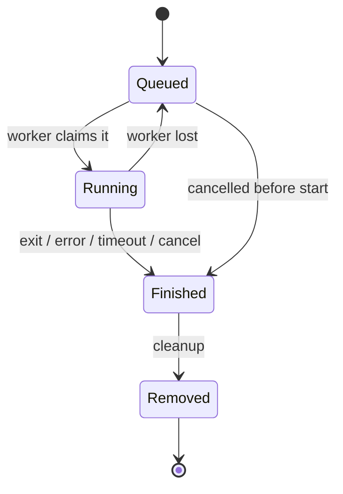

# Queues, jobs & ids

## Queues

A queue is any string used as a path segment:

```
POST https://container.mtfm.io/q/<queue>
```

- Created implicitly on first use.
- Never needs deleting — an empty queue with no workers is nothing.
- **Unguessable name = private queue.** There is no other access control.
- Workers attach by name: `docker run ... run <queue>`.

Good queue names: `q-1f9c8b62-…` (a UUID), `acme-3f7a91d2c4`. Bad queue names: `test`, `jobs`, `prod`.

### Queue status

```sh
curl -s https://container.mtfm.io/q/$QUEUE/status
```

Tells you the jobs it knows about, the workers currently connected, and their CPU/GPU counts. If `localWorkerCount` is
`0`, nothing will ever run — that is the first thing to check when a job sits in `Queued` forever.

Prometheus metrics: `GET /q/<queue>/metrics`.

## Job ids are content hashes

```
jobId = sha256(canonical(definition))
```

Submit without an `id` and the server computes it and returns it. This gives you deduplication for free, and one sharp
edge:

::: warning Identical definitions are the same job
Two submissions of the same definition are **one** job. If it already ran, you immediately get the previous result
rather than a new execution.
:::

To force a distinct run, change the definition — an unused env var, a nonce in the command, a `configFiles` entry:

```json
{
  "image": "alpine:3.19.1",
  "command": "sh -c \"date > /outputs/when.txt\"",
  "env": { "NONCE": "2026-07-24T09:14:22.113Z" }
}
```

## Job states



| State      | Meaning                                                             |
| ---------- | ------------------------------------------------------------------- |
| `Queued`   | Accepted, waiting for a worker.                                     |
| `Running`  | A worker has it. Logs stream over the websocket.                    |
| `Finished` | Terminal. Read `finishedReason` — it is _not_ necessarily success.  |
| `Removed`  | A short-lived tombstone so clients see the removal before deletion. |

`finishedReason` is one of `Success`, `Error`, `TimedOut`, `Cancelled`, `WorkerLost`, `JobReplacedByClient`, `Deleted`.
**Always check it**, and check `result.StatusCode` too: a container that exits non-zero still finishes with reason
`Success` — the _job_ succeeded, the _program_ failed.

```js
const ok = data.finishedReason === "Success" && data.finished?.result?.StatusCode === 0;
```

## Namespaces: one live job per user/tab/document

`control.namespace` partitions a queue into slots that hold exactly one job. Submitting into a namespace removes
whatever was there before.

```json
{
  "definition": { "image": "alpine:3.19.1", "command": "sleep 30" },
  "control": { "namespace": "user-42:doc-7" }
}
```

Use it when a client can re-submit faster than jobs complete — an editor that re-runs on every keystroke, a dashboard
that refreshes on input. Without it you queue up work nobody is waiting for any more. The default namespace is `_`.

## Cancelling

```sh
curl -s -X POST https://container.mtfm.io/q/$QUEUE/j/$JOB_ID/cancel
```

The job finishes with reason `Cancelled`. A running container is killed unless another namespace is still waiting on the
same job.

## Timeouts

Two independent limits, whichever hits first:

- `definition.maxDuration` / `definition.requirements.maxDuration` — per job, e.g. `"20m"`, `"1h"`, `"90s"`.
- The worker's `--max-job-duration` — the ceiling that machine will allow.

Hitting either finishes the job with reason `TimedOut`.

## Retention

Job records and blobs on the public instance expire after roughly a month. Anything you need to keep, copy out.
Self-host if you need different retention.
